# Judul     : Menjelajahi Pola dan Tren Kanker Paru-paru: Pendekatan Berbasis EDA untuk Prediksi

## Projek UAS B DATA 2023
## Anggota   : 

-  ## Dio Aulia Ari Kurnia Sandi (2041720086)
-  ## Muhammad Hamamiy Zadah     (2041720028)

## Penjelasan Proyek

Proyek  Menjelajahi Pola dan Tren Kanker Paru-paru tujuan untuk meningkatkan akurasi prediksi. Penelitian sebelumnya juga menunjukkan bahwa kebiasaan merokok merupakan faktor risiko utama kanker paru-paru di Indonesia. Oleh karena itu, penelitian ini dapat memberikan kontribusi penting dalam upaya pencegahan dan pengobatan kanker paru-paru di Indonesia.

## Setup dan Running
- Clone repository GitHub: gunakan perintah git clone https://github.com/hamamizadah/project-big-data-2023 untuk menduplikasi repository proyek ini ke perangkat Anda.

- Buka situs colab.research.google.com pada browser Anda.

- Unggah file PreprocessingBigData.ipynb dan Tubes_Bigdata.ipynb yang telah anda unduh sebelumnya di dalam folder src ke Google Colab engan mengklik tombol "Upload" diantarmuka Google Colab.

- Sekarang, jalankan setiap baris kode pada setiap sel satu per satu, mulai dari baris impor (import) hingga mencapai hasil akhir. Anda dapat menjalankan setiap sel dengan mengklik ikon "Run" di sebelah kiri masing-masing sel atau menggunakan pintasan keyboard seperti Shift + Enter.

## Penjelasan Metode

### Life Cycle
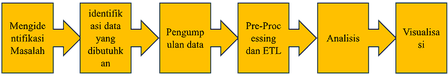

### Flow Chart
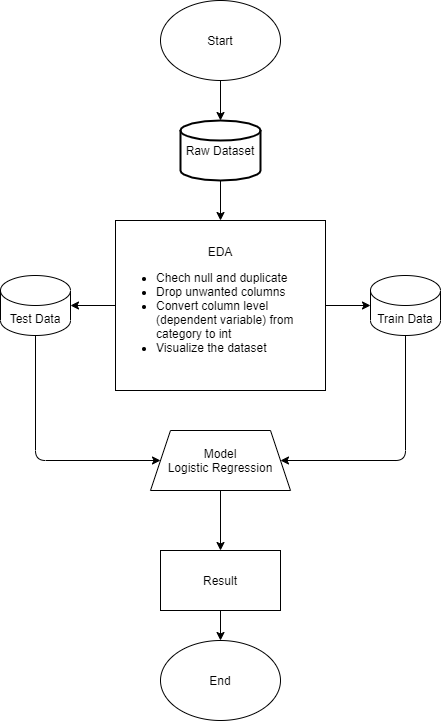

Pendekatan berbasis EDA menggunakan grafik, plot, dan teknik visualisasi data lainnya untuk memperoleh pemahaman yang lebih dalam tentang karakteristik data kanker paru-paru. Metode ini juga melibatkan analisis deskriptif, seperti perhitungan statistik sederhana dan pengelompokan data untuk mengidentifikasi kelompok yang berbeda.

### Preprocessing Big Data
1. install pyspark
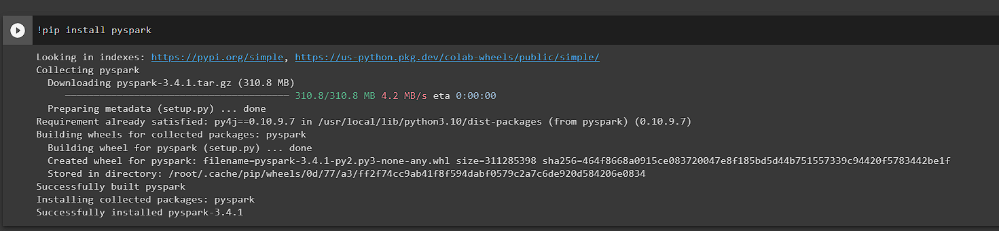

2. import Spark Session
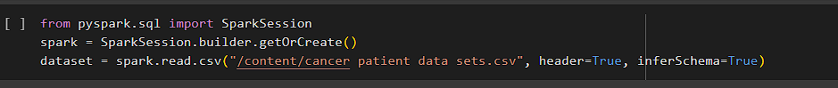

3. menghilangkan nilai null

    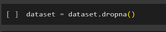

4. memilih kolom yang akan digunakan pada dataset
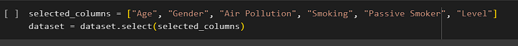

5. save hasil dari dataset terbaru

    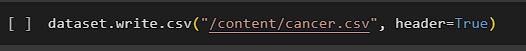

### Tubes Big Data
1. import library 

    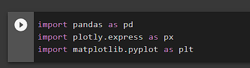

2. membaca dataset terbaru

    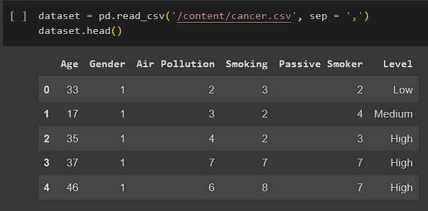

3. menyajikan grafik dari pengidap kanker berdasarkan umur
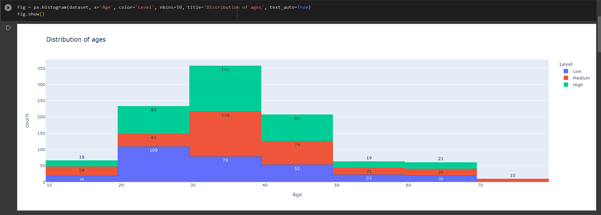

4. menyajikan grafik dari pengidap kanker berdasarkan Air pollution (Polusi udara)
.png)

5. menyajikan grafik dari pengidap kanker berdasarkan gender
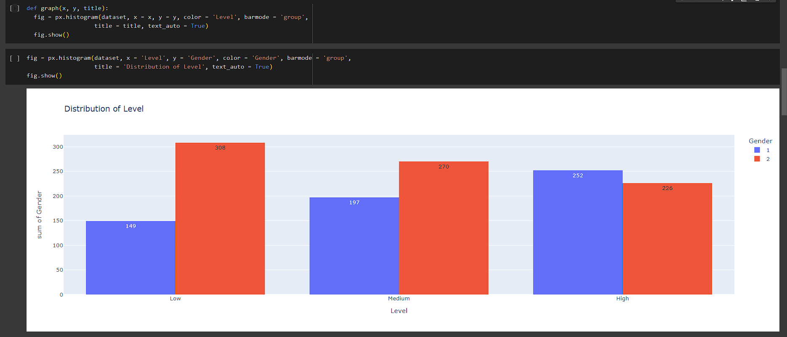

6. menyajikan grafik dari pengidap kanker berdasarkan perokok
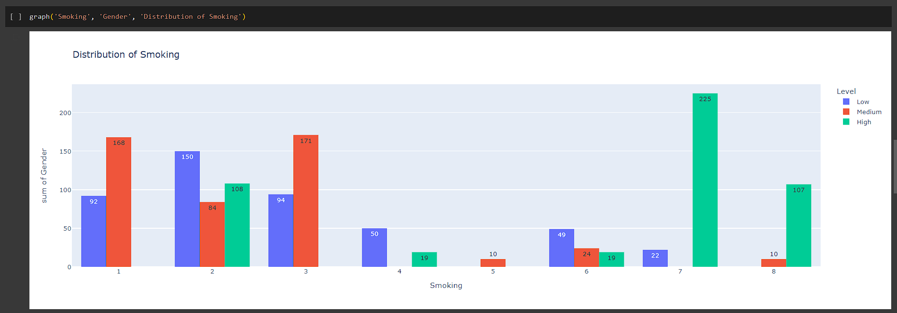

7. menyajikan grafik dari pengidap kanker berdasarkan perokok pasif
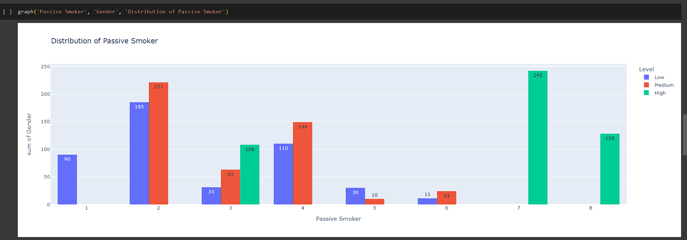

8. histogram dari grafik 
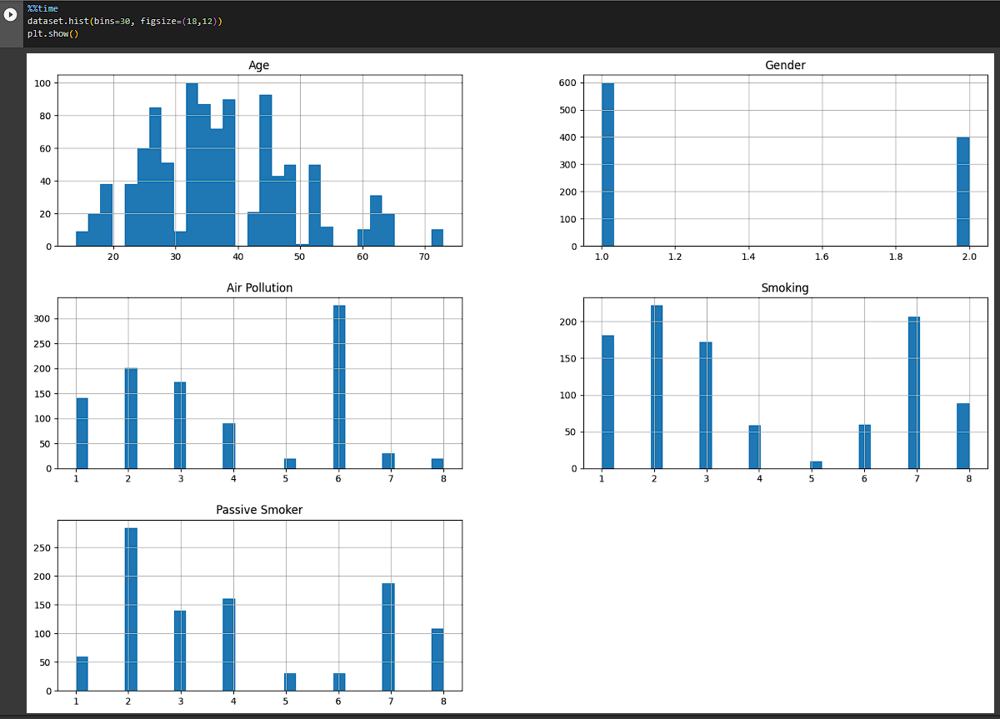

9. mendefinisikan variabel 

    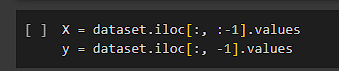

10. melakukan training
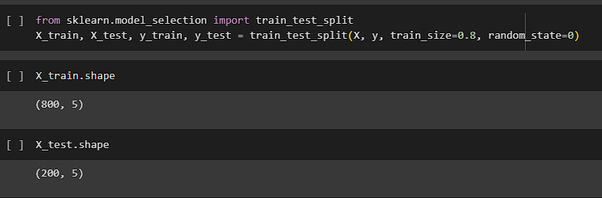

11. menggunakan prediksi logistic regression
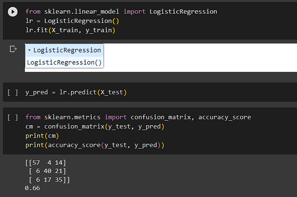

dari hasil prediksi logistic regression dengan score 0.66

## Refrensi
https://www.kaggle.com/datasets/thedevastator/cancer-patients-and-air-pollution-a-new-link

